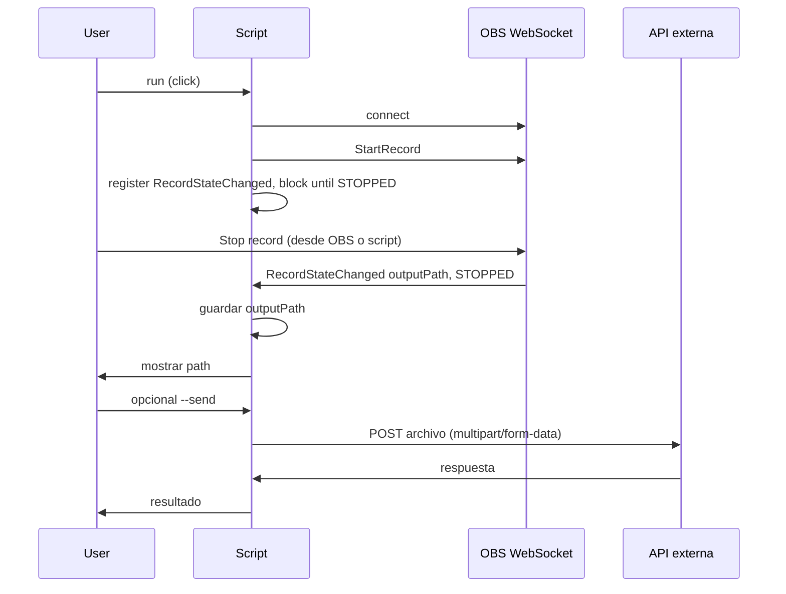

# Careless whisper

is a project to automate and enhace my workflows as dev using AI.

## 🚀 Gestión de Dependencias con uv

Este proyecto usa [**uv**](https://github.com/astral-sh/uv), un gestor de paquetes Python extremadamente rápido escrito en Rust.

### ¿Por qué uv?

- ⚡ **10-100x más rápido** que pip
- 🔒 Lock file automático para reproducibilidad
- 🎯 Gestión integrada de entornos virtuales
- 📦 Compatible con pyproject.toml (PEP 621)

### Instalación de uv

```shell
# macOS/Linux
curl -LsSf https://astral.sh/uv/install.sh | sh

# O con pip (si ya tienes Python)
pip install uv

# Windows
powershell -c "irm https://astral.sh/uv/install.ps1 | iex"
```

### Comandos Principales

```shell
# Instalar dependencias
uv sync

# Agregar nueva dependencia
uv add nombre-paquete

# Ejecutar script con el entorno del proyecto
uv run python script.py

# Activar entorno virtual manualmente
source .venv/bin/activate  # Linux/Mac
.venv\Scripts\activate     # Windows
```

### Migración desde pip

Si anteriormente usabas `pip` y `requirements.txt`:

```shell
# El proyecto ahora usa pyproject.toml como fuente de verdad
# Simplemente ejecuta:
uv sync

# requirements.txt se mantiene para compatibilidad, pero es legacy
# Si prefieres seguir usando pip:
pip install -e .
```

## OBS Controller CLI

Un script CLI en Python para controlar OBS Studio via WebSocket.

### Características

- 🎬 Control de grabación en OBS (iniciar/detener)
- 📡 Escucha de eventos en tiempo real
- 📊 Consulta del estado actual de OBS
- 🔐 Configuración segura mediante archivo .env
- 🎯 CLI intuitiva con argumentos claros
- 📋 Utilidad para copiar texto Lorem Ipsum al clipboard (sin necesidad de OBS)

### Requisitos Previos

1. **Instalar uv** (gestor de paquetes Python ultrarrápido):
   ```shell
   # macOS/Linux
   curl -LsSf https://astral.sh/uv/install.sh | sh
   
   # O con pip
   pip install uv
   ```

2. **OBS Studio** debe estar ejecutándose (solo para funciones de OBS)
3. **Habilitar WebSocket en OBS**: 
   - Ve a `Tools` → `WebSocket Server Settings`
   - Marca "Enable WebSocket server"
   - Configura un puerto (default: 4455) y contraseña opcional

### Configuración Inicial

```shell
# 1. Instalar dependencias con uv
uv sync

# 2. Copia el archivo de ejemplo
cp .env.example .env

# 3. Edita .env con tus credenciales de OBS
# OBS_HOST=localhost
# OBS_PORT=4455
# OBS_PASSWORD=tu_contraseña
```

### Uso

```shell
# Iniciar grabación en OBS
uv run python obs_controller.py --action start-recording

# Detener grabación en OBS
uv run python obs_controller.py --action stop-recording

# Ver estado actual de OBS (versión, estado de grabación, etc.)
uv run python obs_controller.py --action status

# Escuchar todos los eventos de OBS en tiempo real
# (mantiene el script ejecutándose, presiona Ctrl+C para detener)
uv run python obs_controller.py --action listen-events

# Copiar texto Lorem Ipsum aleatorio al clipboard (no requiere OBS)
uv run python obs_controller.py --action copy-random-text

# Override de configuración desde CLI (no usa .env)
uv run python obs_controller.py --action status --host localhost --port 4455 --password mipass

# O después de activar el entorno virtual
uv sync
source .venv/bin/activate  # En Windows: .venv\Scripts\activate
python obs_controller.py --action start-recording
```

### Eventos que Escucha

Cuando usas `--action listen-events`, el script captura y muestra:

- 🔴 **Eventos de Grabación**: inicio, detención, pausa, reanudación
- 📺 **Eventos de Streaming**: inicio, detención
- 🎭 **Cambios de Escena**: transiciones entre escenas
- 🎚️ **Cambios de Sources**: habilitación/deshabilitación de elementos
- 📊 **Métricas de Audio**: niveles de volumen (VU meters)
- 🚪 **Eventos de Sistema**: cierre de OBS

Cada evento se muestra con:
- Timestamp
- Tipo de evento
- Datos asociados al evento

## OBS Record and Send

Script con Click que inicia la grabación en OBS vía WebSocket, espera a que la detengas desde OBS, captura el path del archivo resultante y opcionalmente lo envía a una API externa.

### Flujo del script



### Uso

```shell
# Grabar y solo mostrar el path del archivo (detén la grabación desde OBS)
uv run python record_and_send.py record

# Grabar y enviar el archivo a la API configurada en .env
uv run python record_and_send.py record --send

# Enviar un archivo ya grabado a la API
uv run python record_and_send.py send --file /ruta/al/video.mp4 --api-url https://api.example.com/process
```

Variables en `.env`: `OBS_HOST`, `OBS_PORT`, `OBS_PASSWORD`, `RECORD_SEND_API_URL`, `RECORD_SEND_API_TOKEN` (opcional).

## Audio Recorder CLI

Un script CLI en Python para grabar audio usando ffmpeg.

### Características

- 🎙️ Grabación de audio con ffmpeg
- 🔍 Lista automática de dispositivos disponibles
- ⏱️ Duración configurable o indefinida (Ctrl+C para detener)
- 🚀 Ejecuta comandos después de grabar
- 📁 Guarda grabaciones en carpeta configurable

### Uso

```shell
# Listar dispositivos disponibles
python audio_recorder.py --list-devices

# Grabar con dispositivo específico
python audio_recorder.py --device 0

# Grabar 10 segundos
python audio_recorder.py --device 0 --duration 10

# Grabar y ejecutar comando después
python audio_recorder.py --device 0 --post-command "echo 'Listo: {file}'"

# Si no especificas dispositivo, te pedirá elegir uno
python audio_recorder.py

# Con nombre personalizado y directorio específico
python audio_recorder.py --device 0 --output mi_audio.wav --output-dir ~/grabaciones
```

### Variables en post-command

- `{file}` - Ruta completa del archivo
- `{filename}` - Solo el nombre del archivo
- `{filepath}` - Ruta absoluta del archivo

## Dependencies

### Python Packages

Gestionado con **uv** (gestor de paquetes ultrarrápido):

```shell
# Instalar uv
curl -LsSf https://astral.sh/uv/install.sh | sh

# Instalar dependencias del proyecto
uv sync
```

Dependencias incluidas en `pyproject.toml`:
- `obs-websocket-py` - Cliente WebSocket para OBS Studio
- `python-dotenv` - Carga variables de entorno desde .env
- `pyperclip` - Gestión del clipboard del sistema

### Mac

fswatch to check dfs changes

```shell
brew install fswatch
brew install ffmpeg

# copy 

launchctl load ~/Library/LaunchAgents/com.tudominio.folderwatcher.plist

```


### Linux

### Windows

not supported because sucks :)
